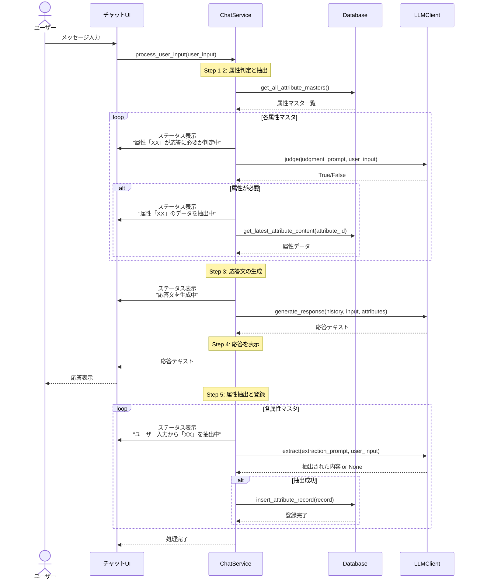
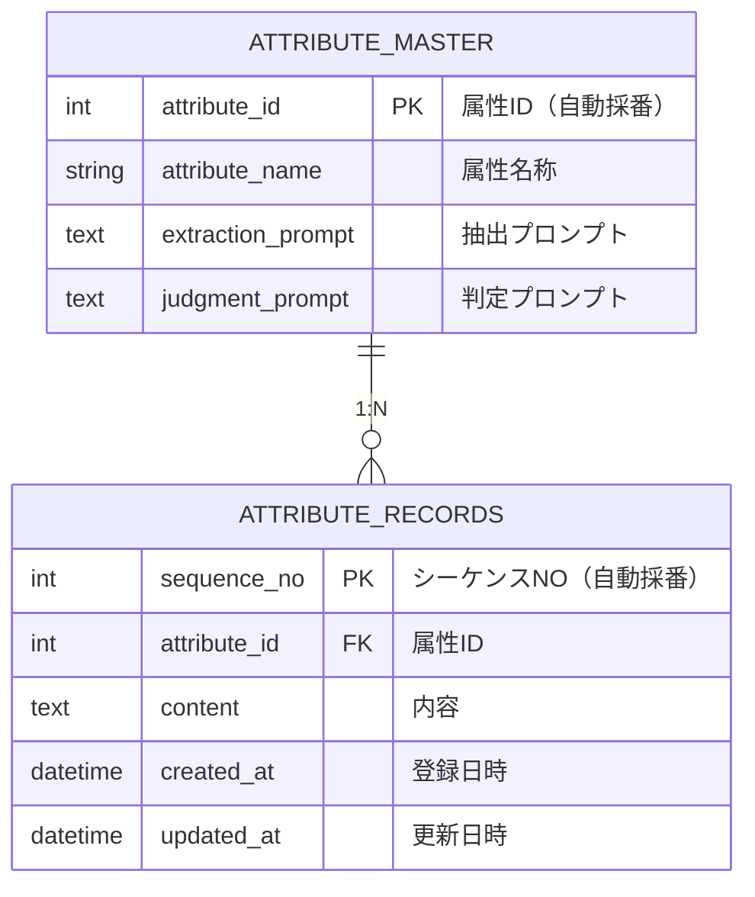
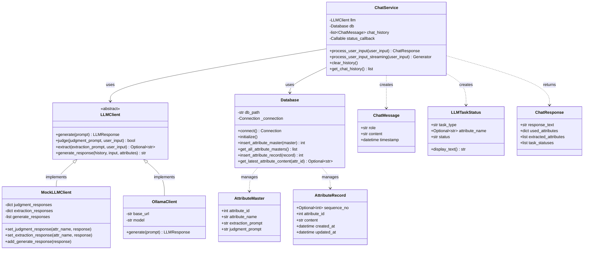
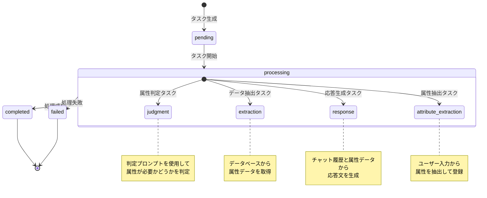
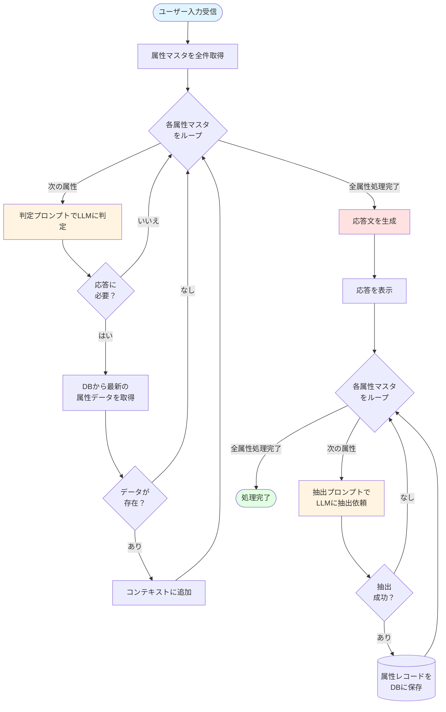
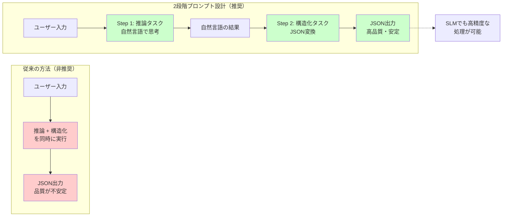
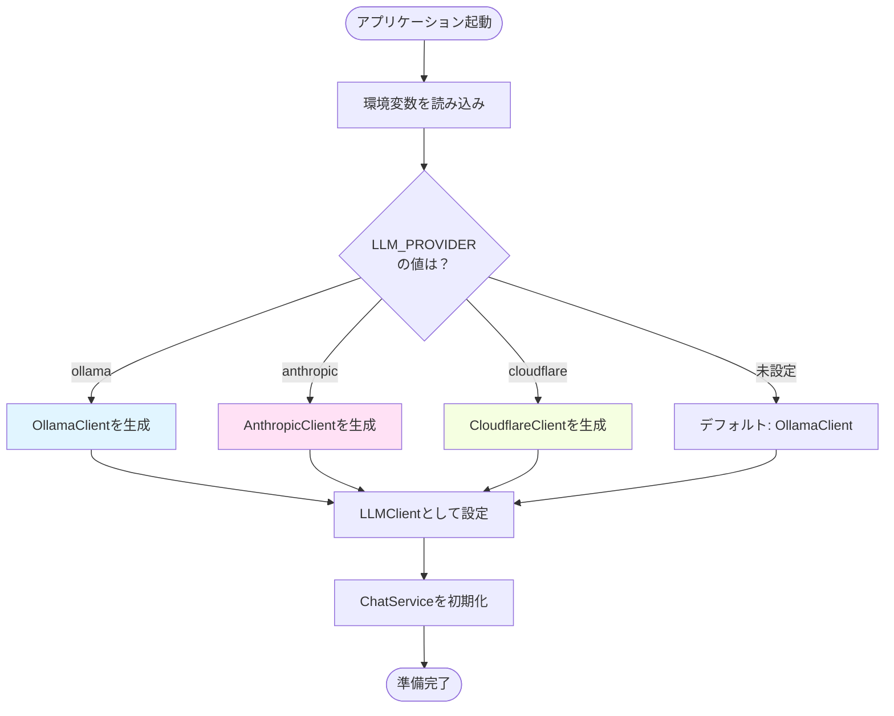

# Memory Assistant v4 フロー図

このドキュメントでは、Memory Assistant v4の実装を視覚的に理解できるように、各種フロー図をmermaid記法で提供します。

## 目次

1. [システムアーキテクチャ図](#システムアーキテクチャ図)
2. [チャットワークフローシーケンス図](#チャットワークフローシーケンス図)
3. [データベースER図](#データベースer図)
4. [クラス図](#クラス図)
5. [LLMタスク状態遷移図](#llmタスク状態遷移図)
6. [属性判定・抽出フロー](#属性判定抽出フロー)

---

## システムアーキテクチャ図

システム全体の構成とコンポーネント間の関係を示します。

```mermaid
graph TB
    subgraph "ユーザーインターフェース層"
        UI[チャットUI]
        LogUI[ログ確認画面]
        MasterUI[属性マスタ保守画面]
        RecordUI[属性テーブル保守画面]
    end

    subgraph "アプリケーション層"
        ChatService[ChatService<br/>チャットワークフロー管理]
        StatusCallback[ステータスコールバック<br/>リアルタイム表示]
    end

    subgraph "LLM層"
        LLMClient[LLMClient<br/>抽象インターフェース]
        MockLLM[MockLLMClient<br/>テスト用]
        OllamaLLM[OllamaClient<br/>Ollama API]
        AnthropicLLM[AnthropicClient<br/>Claude API]
        CloudflareLLM[CloudflareClient<br/>Workers AI]
    end

    subgraph "データ層"
        Database[Database<br/>SQLite操作]
        Models[Models<br/>データモデル定義]
    end

    subgraph "外部サービス"
        Ollama[Ollama<br/>llama3.1:8b]
        Claude[Anthropic Claude]
        Workers[Cloudflare Workers]
    end

    UI --> ChatService
    LogUI --> Database
    MasterUI --> Database
    RecordUI --> Database

    ChatService --> LLMClient
    ChatService --> Database
    ChatService --> StatusCallback

    LLMClient <|-- MockLLM
    LLMClient <|-- OllamaLLM
    LLMClient <|-- AnthropicLLM
    LLMClient <|-- CloudflareLLM

    OllamaLLM --> Ollama
    AnthropicLLM --> Claude
    CloudflareLLM --> Workers

    Database --> Models
    StatusCallback --> UI

    style ChatService fill:#e1f5ff
    style LLMClient fill:#fff4e1
    style Database fill:#f0f0f0
```

---

## チャットワークフローシーケンス図

ユーザー入力から応答生成までの処理フローを時系列で示します。



---

## データベースER図

属性マスタと属性テーブルの関係を示します。



---

## クラス図

主要なクラスとその関係を示します。



---

## LLMタスク状態遷移図

LLMタスクの処理状態の遷移を示します。



---

## 属性判定・抽出フロー

属性マスタを使った判定・抽出の詳細フローを示します。



---

## 2段階プロンプト設計の概念図

推論タスクと構造化タスクを分離する設計思想を示します。



---

## LLMプロバイダー切り替えフロー

複数のLLMプロバイダーに対応する仕組みを示します。



---

## 使用方法

これらの図は、以下のmermaid対応ツールで表示できます：

- **GitHub**: `.md`ファイルに記述すれば自動的にレンダリングされます
- **VS Code**: Mermaid拡張機能をインストール
- **オンラインエディタ**: [Mermaid Live Editor](https://mermaid.live/)
- **ドキュメントサイト**: GitBook、MkDocs、Docusaurusなど

## 参考ドキュメント

- [design.md](design.md) - システム設計の詳細
- [README.md](README.md) - プロジェクト概要
- [JSON-Schema-compliant.md](JSON-Schema-compliant.md) - 2段階プロンプト設計の理論
